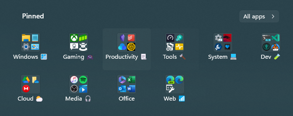
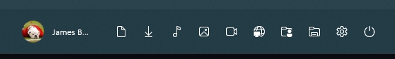
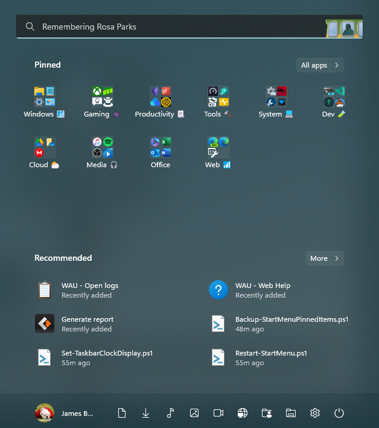

<h1 vertical-align="middle">Windows 11 Start Menu</h1></img> 

> Start Menu Documentation and Notes

This document provides docs and notes on the Windows 11 Start Menu Setup and Configuration.

<center>



</center>

## Contents

[TOC]


## Overview

Windows 11 introduced a new way of configuring and maintaining the Start Menu and its customizations.

If Windows 10 wasn't bad enough in terms of complexity and lack of documentation, Windows 11 is even worse...

The Windows 11 Start Menu and Taskbar Configuration Setup now has *three* separate configuration setting areas:

- Start Menu
- Start Menu Folders
- TaskBar

## PowerShell

To manage the Start Menu Layout via the Registry is not as easy as using PowerShell.

You can export and import the layout via:

```powershell
# Export
Export-StartLayout -Path "StartLayout.xml"

# Import 
Import-StartLayout -LayoutPath "StartLayout.xml" -MountPath "$Env:SystemDrive\"
```

An example for adding `Application`'s link to the Start Menu and exporting/backing up the configuration's `JSON` and 
re-importing (i.e. *This allows different start menu’s to be imported based on scripted criteria*).

```powershell
Copy-Item -Path "$PSScriptRoot\Application.lnk" -Destination "$Env:AllUsersProfile\Microsoft\Windows\Start Menu\Programs\Application.lnk"
$StartMenuLayout = 'Win11_StartMenu.json'
Import-StartLayout -LayoutPath "$PSScriptRoot\$StartMenuLayout" -MountPath "$Env:SystemDrive\"
```

## Start Menu

The Start Menu is now a `JSON` file (used to be `XML`) stored under the path:
`%LocalAppdata%\Packages\Microsoft.Windows.StartMenuExperienceHost_cw5n1h2txyewy\LocalState\`.

The configurations for a user are encrypted to a level way past my personal understanding, but I was able to find the 
following:

<blockquote class="twitter-tweet" data-lang="en" data-dnt="true" data-theme="dark"><p lang="en" dir="ltr">Turns out the Windows 11 start menu stores its persistent state in an AES CBC PKCS7 encrypted JSON whose crypto input parameters feature a salt that utilizes Mersenne Twister PRNG.<br>Initially thought this may be an anti-tamper measure but the file can be swapped across installs.</p>&mdash; Albacore (@thebookisclosed) <a href="https://twitter.com/thebookisclosed/status/1447317034786770945?ref_src=twsrc%5Etfw">October 10, 2021</a></blockquote> <script async src="https://platform.twitter.com/widgets.js" charset="utf-8"></script>

***

In order to maintain this for a user, one can:

- Customize the Start Menu Layout Manually
- Backup the file: `%LocalAppdata%\Packages\Microsoft.Windows.StartMenuExperienceHost_cw5n1h2txyewy\LocalState\start.bin`
- Restore the file as necessary by simply copying back and overwriting:

```cmd
xcopy "start.bin" "C:\Users\Default\AppData\Local\Packages\Microsoft.Windows.StartMenuExperienceHost_cw5n1h2txyewy\LocalState\" /y`
```

## Start Menu Folders

Another section has been added to the Start Menu called *Start Menu Folders*.



The *Start Menu Folders* (which can be customized by the user via `ms-settings > Personalization`) is configured 
at the *machine level* in the registry under the keys located at `HKLM\SOFTWARE\Microsoft\PolicyManager\current\device\Start\*`. 

An example is the key: `HKLM\SOFTWARE\Microsoft\PolicyManager\current\device\Start\AllowPinnedFolderDownloads`,
representing the Downloads folder display, and if its `DWORD` value is set to `1` it will appear.

The registry keys for every possible folder are as follows:

> Source: [Add or Remove Folders on Start List in Windows 10 - Page 5 - | Tutorials (tenforums.com)](https://www.tenforums.com/tutorials/2192-add-remove-folders-start-list-windows-10-a-5.html)

```registry
Windows Registry Editor Version 5.00

[HKEY_LOCAL_MACHINE\SOFTWARE\Microsoft\PolicyManager\current\device\Start]

"AllowPinnedFolderDocuments"=dword:00000001
"AllowPinnedFolderDocuments_ProviderSet"=dword:00000001
"AllowPinnedFolderDownloads"=dword:00000001
"AllowPinnedFolderDownloads_ProviderSet"=dword:00000001
"AllowPinnedFolderFileExplorer"=dword:00000001
"AllowPinnedFolderFileExplorer_ProviderSet"=dword:00000001
"AllowPinnedFolderMusic"=dword:00000001
"AllowPinnedFolderMusic_ProviderSet"=dword:00000001
"AllowPinnedFolderNetwork"=dword:00000001
"AllowPinnedFolderNetwork_ProviderSet"=dword:00000001
"AllowPinnedFolderPersonalFolder"=dword:00000001
"AllowPinnedFolderPersonalFolder_ProviderSet"=dword:00000001
"AllowPinnedFolderPictures"=dword:00000001
"AllowPinnedFolderPictures_ProviderSet"=dword:00000001
"AllowPinnedFolderSettings"=dword:00000001
"AllowPinnedFolderSettings_ProviderSet"=dword:00000001
"AllowPinnedFolderVideos"=dword:00000001
"AllowPinnedFolderVideos_ProviderSet"=dword:00000001
```

ignoring the `_ProviderSet` values, which represent enable/disable the ability for the user to toggle that folder on or off
from the Start Menu we are left with key-values for the folders:

- Documents
- Downloads
- Explorer
- Music
- Network
- Personal Folder (User Folder | `%USERPROFILE%` | `~` | `$HOME`)
- Pictures
- Settings
- Videos

as the possible options to display.

Here's the registry ignoreing the `_ProviderSet` values:

```registry
Windows Registry Editor Version 5.00

[HKEY_LOCAL_MACHINE\SOFTWARE\Microsoft\PolicyManager\current\device\Start]

"AllowPinnedFolderDocuments"=dword:00000001
"AllowPinnedFolderDownloads"=dword:00000001
"AllowPinnedFolderFileExplorer"=dword:00000001
"AllowPinnedFolderMusic"=dword:00000001
"AllowPinnedFolderNetwork"=dword:00000001
"AllowPinnedFolderPersonalFolder"=dword:00000001
"AllowPinnedFolderPictures"=dword:00000001
"AllowPinnedFolderSettings"=dword:00000001
"AllowPinnedFolderVideos"=dword:00000001
```

> Note that these settings can also be managed via [Start Policy CSP - Windows Client Management | Microsoft Learn](https://learn.microsoft.com/en-us/windows/client-management/mdm/policy-csp-start).

## TaskBar

Finally, there's the taskbar.

In Windows 11, the taskbar is managed mostly the same as it was in Windows 10 via an `XML` file:

[Configure and customize Windows 11 taskbar - Configure Windows | Microsoft Learn](https://learn.microsoft.com/en-us/windows/configuration/customize-taskbar-windows-11)

but note that there no longer is a `start` section in the `XML`, or it will be ignored.


***

## References

- [Windows 11 start menu configuration | Hayes Jupe's Blog](https://www.hayesjupe.com/windows-11-start-menu-configuration/)
- [Configure and customize Windows 11 taskbar - Configure Windows | Microsoft Learn](https://learn.microsoft.com/en-us/windows/configuration/customize-taskbar-windows-11)
- [Start Policy CSP - Windows Client Management | Microsoft Learn](https://learn.microsoft.com/en-us/windows/client-management/mdm/policy-csp-start)
- [Add or Remove Folders on Start List in Windows 10 - Page 5 - | Tutorials (tenforums.com)](https://www.tenforums.com/tutorials/2192-add-remove-folders-start-list-windows-10-a-5.html)

***



